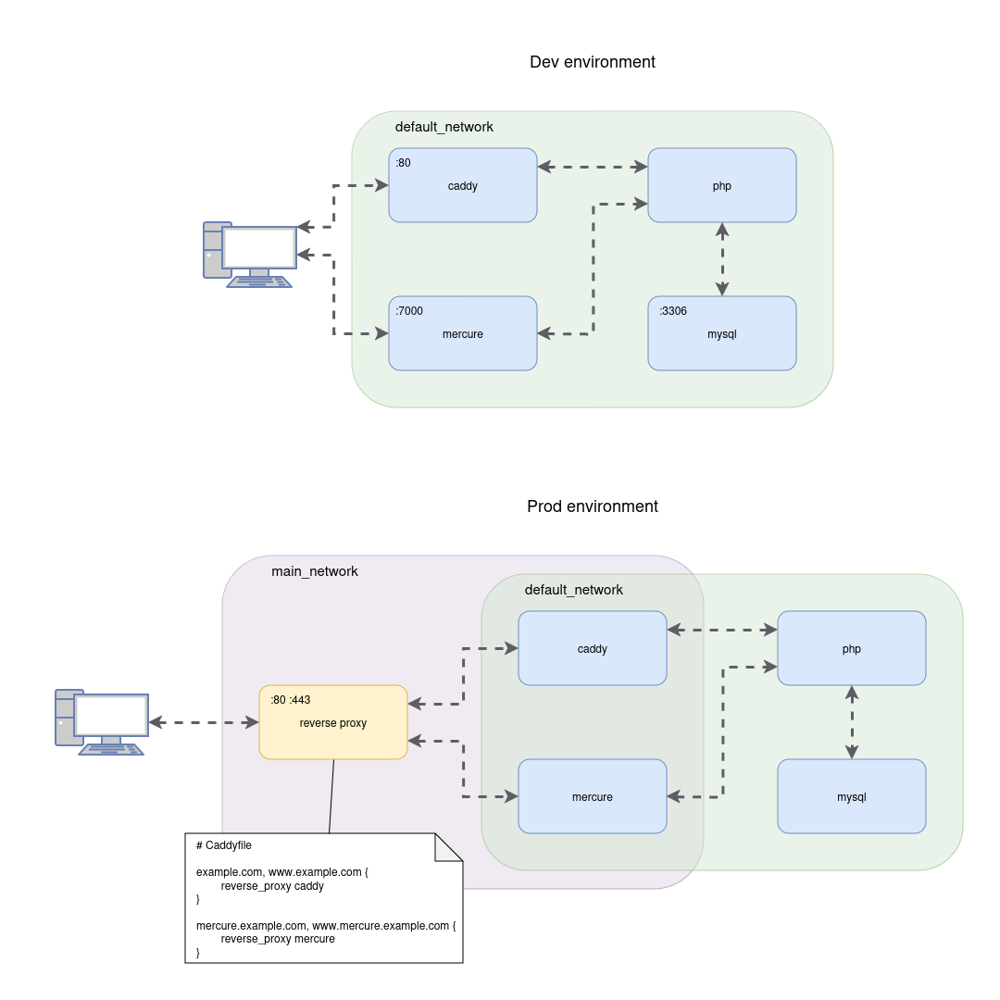

# File upload service
This is a simple dummy project to demonstrate how to dockerize a Symfony application.

## Requirements
- Docker

## Introduction
This project is a simple file upload service.
It contains 2 docker builds:
- One for the `dev` environment;
- One for the `prod` environment.

The `dev` environment is designed to be standalone: it contains a Caddy container, a PHP container, and a MySQL container.<br>
The `prod` environment is designed to be deployed on a dockerized reverse proxy.

> **Note:** Following the same principle, you can easily add other environments like `test`, `staging`, etc.

## The Dockerfile
The Dockerfile is designed to be as simple as possible.<br>
It uses a multi-stage build to keep the final image as light as possible.<br>

> **Note:** The Dockerfile is pretty basic, you should adapt it to your needs.

### Images:
- `caddy`: a caddy:2.7.6-alpine based image;
- `php_base`: a php:8.2-fpm-alpine based image, this image is the base for the `dev` and `prod` images;
- `php_dev`: the `dev` image, based on the `php_base` image, it should only contain the necessary tools for development;
- `php_prod`: the `prod` image, based on the `php_base` image, it should only contain the necessary tools for production.

## Differences between `dev` and `prod` builds

In the dev environment the Caddy server should be accessible from the host machine on a port (80 in this case but can be anything),
while in the prod environment the Caddy server should not be accessible from the host machine directly.<br>
The Caddy server should be behind a reverse proxy, this means that the Caddy server and the container acting as a reverse proxy should be on the same network (main_network in this example).


*This diagram shows the communication flows between containers in a dev and prod environments.*

To achieve this, the `docker compose.yaml` is overridden by the `docker compose.override.yaml` file for the dev environment.<br>
For the prod environment, the `docker compose.yaml` is overridden by the `docker compose.override.prod.yaml` file.<br>
The difference between the two overrides is simple: instead of mapping any port in the `docker compose.yaml` file, it is done in the `docker compose.override.yaml` file for the dev environment, and since the prod environment should not be accessible from the host machine, we do not map any port in the `docker compose.override.prod.yaml` file.<br>
In addition, for the `prod` environment, the Caddy container must be connected to the same network (main_network) the reverse proxy container is connected to in order to be able to communicate with each other;
the Caddy container needs to communicate with the PHP container as well and since in the `docker compose.override.prod.yaml` file the network configuration is overridden, it must be connected to the default network explicitly.

## How to run the project
The ```Dockerfile``` as well as the ```docker compose.yaml``` and the ```docker compose.override.yaml``` files are located in the docker directory.<br>
So move to the docker directory:
```bash
cd docker
```
Finally, to run the project for the `dev` environment, you just need to run the following command:
```bash
docker compose up
```
With this command docker will automatically merge the `docker compose.yaml` and the `docker compose.override.yaml` files.

> **Note:** Don't forget to copy the `.env` file to `.env.local` and change the Mercure variables if you want to use Mercure in the dev environment.<br>
> MERCURE_URL=http://file_upload_service_mercure/.well-known/mercure<br>
> MERCURE_PUBLIC_URL=http://localhost:7000/.well-known/mercure<br>
> MERCURE_JWT_SECRET="!ChangeThisMercureHubJWTSecretKey!"

For the `prod` environment, you need to run the following command:
```bash
docker compose -f docker compose.yaml -f docker compose.override.prod.yaml up
```
This will merge the `docker compose.yaml` and the `docker compose.override.prod.yaml` files.

## Additional notes

### LF vs CRLF
If you are using Windows, you may encounter an issue with the line endings.<br>
To fix this issue, you can run the following command:
```bash
git config --global core.autocrlf input
```
Alternatively, you can add to the `.gitattributes` file the following line:
```
* text text=auto eol=lf
```
The `.gitattributes` provided in this project contains a set of rules typically used for Symfony projects, you can use it as a template for your projects.

### Prefer Debian over Alpine for PHP
Official PHP images are based on Debian and use the ```GNU C library (glibc)``` while Alpine uses ```musl libc``` which is not officially supported by PHP.<br>
This can lead to issues with PHP extensions and other PHP related problems.

### External resources
- [Containerization Tips and Tricks for PHP apps (Article by Kévin Dunglas )](https://dunglas.dev/2024/05/containerization-tips-and-tricks-for-php-apps/)